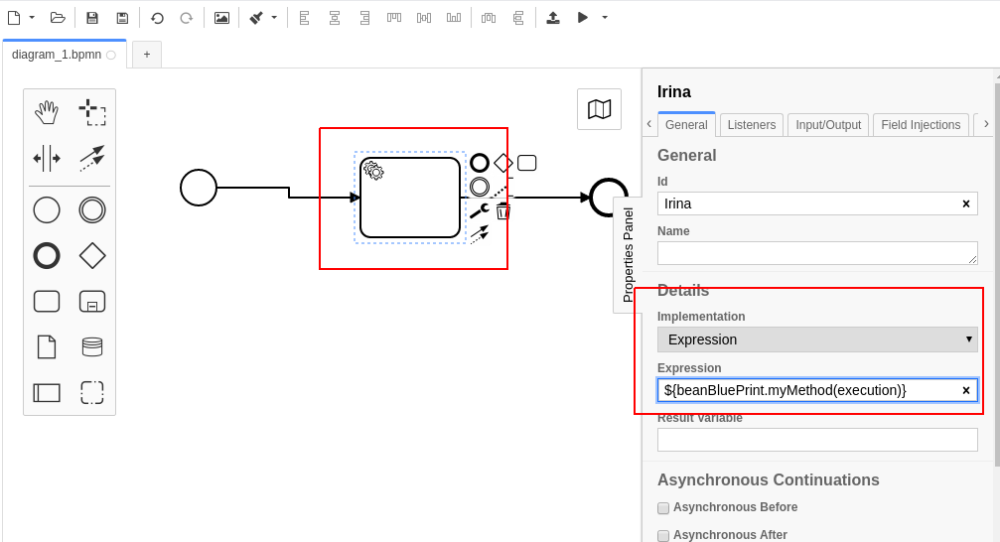

### Связывание Camunda, Karaf, Blueprint

Приложение в Karaf [ApplicationVasi.java](src/main/java/ru/perm/v/camunda/ApplicationVasi.java)

Объявляется с помощью [processes.xml](src/main/resources/META-INF/processes.xml). Путь важен. Иначе нужно определить deploymentDescriptors

````java
@ProcessApplication(name = "applicationvasi", deploymentDescriptors={"META-INF/processes.xml"})
@Slf4j
public class ApplicationVasi extends OSGiProcessApplication {
    public ApplicationVasi(BundleContext ctx, BlueprintContainer blueprintContainer) {

````

Пользовательский процесс camunda в [](src/main/resources/diagram_1.bpmn) должен попасть в бандл

Типичный BeanBluePrint. Из camunda доступен через 

````
camunda:expression="${beanBluePrint.myMethod(execution)}"
````



>Вызов blueprint сервиса ${delegateService.callOnExecution(execution)} не прокатил :(